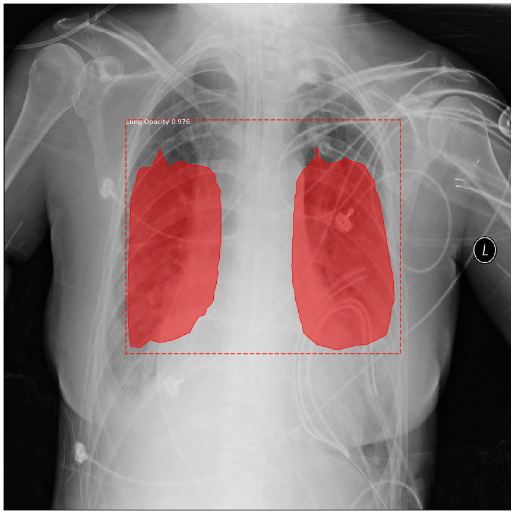

# Pneumonia Detection #
This project is an attempt to build a machine learning model using deep learning that will to 
detect instances of pneumonia (lung opacity) infections in chest radiographs (CXRs). The model will 
leverage a state-of-the-art object detection and instance segmentation algorithms known as 
[Mask R-CNN](https://arxiv.org/pdf/1703.06870.pdf) that will help accurately detect the ailment. The
implementation of this algorithm is provided by [Matterport](https://github.com/matterport/Mask_RCNN).



## Files ##
### Notebooks ###
* [pneumonia_detection_analysis.ipynb](pneumonia_detection_analysis.ipynb) shows exploratory data 
analysis of the dataset.
* [pneumonia_detection.ipynb](pneumonia_detection.ipynb) shows how training and inference are done 
using Mask R-CNN, evaluation of the model on a validation set and test results of the final model.
* [inspect_pneumonia_detection_model.ipynb](inspect_pneumonia_detection_model.ipynb) goes in depth 
into the steps performed during pneumonia detection and instance segmentation.
* [inspect_pneumonia_detection_data.ipynb](inspect_pneumonia_detection_data.ipynb) visualizes 
different preprocessing steps to prepare the data for training.

### Code ###
```pneumonia_detection``` and ```utils``` folders contain code used for configuring and preparing
the dataset for training and inference and utility functions used within the notebooks respectively.

### Other files ###
* [proposal.pdf](proposal.pdf) is a report on the exploratory data analysis.
* [pneumonia_detection_report.pdf](pneumonia_detection_report.pdf) is the report on the pneumonia
detection problem, solution and model.
* [detections.csv](detections.csv) contains the outcomes of the detections made on the test dataset.
The first column is the patient ID. The second column contains a sequence of prediction strings of
the format ```confidence x y width height [confidence x y width height ...]```.

### Training Weights ###
Use the trained pneumonia detection model weights for your training; download the weights
[here](https://github.com/osaetinevbuoma/pneumonia_detection/releases/download/weights/mask_rcnn_pneumonia_detection.h5) 
and place in the ```logs``` folder. 

## Requirements ##
This project requires Python >= 3.5, Tensorflow >=1.3, Keras >= 2.0.8 and other packages 
listed in the ```requirements.txt``` file. Download the required libraries by running the 
following command: ```pip3 install -r requirements.txt```.<br />
**Note**: If running on GPU (recommended), follow the Tensorflow instructions for installation,
available [here](https://www.tensorflow.org/install/gpu) instead of installing the CPU version in
the ```requirements.txt``` file.

## Dataset ##
The dataset is provided by [Radiological Society of North America (RSNA®)](http://www.rsna.org/) via
[Kaggle](https://www.kaggle.com). You will be required to accept the competition terms on Kaggle 
and provide your Kaggle username and key in the [pneumonia_detection_analysis.ipynb](pneumonia_detection_analysis.ipynb)
and [pneumonia_detection.ipynb](pneumonia_detection.ipynb) notebooks to download the dataset.

## Reference ##
* Rui P, Kang K. National Ambulatory Medical Care Survey: 2015 Emergency Department Summary 
Tables. Table 27. Available from: [*link*](www.cdc.gov/nchs/data/nhamcs/web_tables/2015_ed_web_tables.pdf)
* Deaths: Final Data for 2015. Supplemental Tables. Tables I-21, I-22. Available from: [*link*](www.cdc.gov/nchs/data/nvsr/nvsr66/nvsr66_06_tables.pdf)
* Franquet T. Imaging of community-acquired pneumonia. J Thorac Imaging 2018 
(epub ahead of print). PMID 30036297
* Kelly B. The Chest Radiograph. Ulster Med J 2012;81(3):143-148
* Wang X, Peng Y, Lu L, Lu Z, Bagheri M, Summers RM. ChestX-ray8: Hospital-scale Chest X-ray 
Database and Benchmarks on Weakly-Supervised Classification and Localization of Common Thorax 
Diseases. IEEE CVPR 2017, [*paper*](http://openaccess.thecvf.com/content_cvpr_2017/papers/Wang_ChestX-ray8_Hospital-Scale_Chest_CVPR_2017_paper.pdf)
* UNICEF: [*link*](https://www.unicef.org/media/media_89995.html)
* Arthur Ouaknine. Review of Deep Learning Algorithms for Object Detection. [*link*](https://medium.com/comet-app/review-of-deep-learning-algorithms-for-object-detection-c1f3d437b852)
* Kaiming He, Georgia Gkioxari, Piotr Dollár, Ross Girshick. Mask R-CNN. [*paper*](https://arxiv.org/pdf/1703.06870.pdf)
* Waleed Abdulla. Splash of Color: Instance Segmentation with Mask R-CNN and TensorFlow. [*link*](https://engineering.matterport.com/splash-of-color-instance-segmentation-with-mask-r-cnn-and-tensorflow-7c761e238b46)